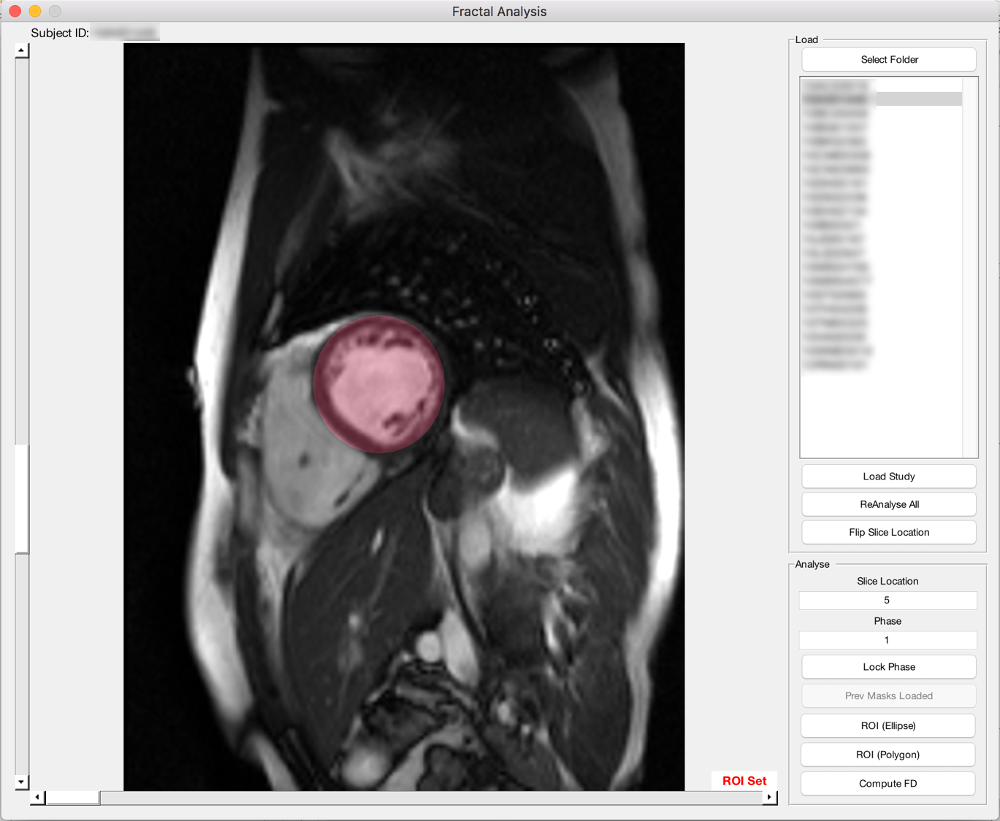

# fracAnalyse

Fractal analysis tool for computation of LV fractal characteristics, using LVSA images from CMR.

## Getting Started

### Prerequisites

It is essential to set up MATLAB Compiler Runtime (MCR) prior to installation of fracAnalyse.

MATLAB Compiler Runtime (MCR): https://www.mathworks.com/products/compiler/mcr.html

### Installing

Download latest release from [Releases](https://github.com/caijiashen/fracAnalyse/releases)

## Analysis

## Authors

* **Jiashen Cai ** - *Duke-NUS Medical School* - [caijiashen](https://github.com/caijiashen)
